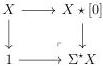
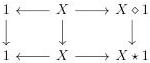

CHAPTER 2. STUDY OF THE COMPLICIAL MODEL

The first one is induced on the level of simplicial sets by

$$(k, \epsilon, l, \alpha) \mapsto (k + \alpha \epsilon (n - k), \epsilon, \epsilon l),$$

and the second one by

$$(k, \epsilon, l, \alpha) \mapsto (k, \epsilon, (\epsilon \vee \alpha) l),$$

where $\epsilon \vee \alpha := \epsilon + \alpha - \epsilon \alpha$. These two morphisms extend to marked simplicial sets.

We proceed in a similar way with cases $(X, Y) = ([n]_t, [m]), ([n], [m]_t)$ or $([n]_t, [m]_t)$.

As we already now that functors $\_ \diamond X$ and $X \diamond \_$ preserve weak equivalences, the previous proposition implies that for any marked simplicial sets $X$, functors $\_ \star X$ and $X \star \_$ preserves weak equivalences and are then left Quillen functors.

**2.2.2.16.** Let $X$ be a marked simplicial set. We now describe an variation on the suspension. We define $\Sigma^{\star} X$, as the following pushout:

This assignation defines a cocontinuous functor $\Sigma^{\star} : \mathrm{mPsh}(\Delta) \to \mathrm{mPsh}(\Delta)_{\partial[1]}$. Using proposition 2.2.2.15, all the vertical morphisms of the following diagram are weak equivalences:

Remark furthermore that the colimits of these lines are also homotopy colimits. Taking the horizontal colimit, this induces a weak equivalence

$$\Sigma X \to \Sigma^{\star} X \tag{2.2.2.17}$$

natural in $X$.

**2.2.2.18.** We define the *co-join* of $X$ and $Y$, denoted by $X \stackrel{co}{\star} Y$, as the colimit of the following diagram:

$$Y \longleftarrow Y \otimes \{1\} \otimes X \longrightarrow Y \otimes [1] \otimes X \longleftarrow Y \otimes \{0\} \otimes X \longrightarrow X$$

The functors

$$\_ \stackrel{co}{\star} X : \mathrm{mPsh}(\Delta) \to \mathrm{mPsh}(\Delta)_{/X} \quad \text{and} \quad X \stackrel{co}{\star} \_ : \mathrm{mPsh}(\Delta) \to \mathrm{mPsh}(\Delta)_{/X}$$

82