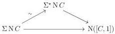
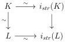

CHAPTER 2. STUDY OF THE COMPLICIAL MODEL

Theorem 2.2.4.1 (Gagna, Ozornova, Rovelli). Let n be an integer. The canonical morphism

\[
[ n ] \to \mathrm{N} (\mathrm{R} ([ n ]))
\]

is an acyclic cofibration.

Proof. This is [GOR21, corollary 5.4].

Theorem 2.2.4.2 (Ozornova, Rovelli). Let \(C\) be an \((0,\omega)\)-category. The canonical morphism

\[
\Sigma \mathrm{N} C \rightarrow \mathrm{N} ([ C, 1 ])
\]

is an acyclic cofibration.

Proof. The morphism (2.2.2.17) provides a weak equivalence \(\Sigma \mathrm{N}C\to \Sigma^{\star}\mathrm{N}C\). As this morphism is sent to an isomorphism by \(R\), it induces a commutative triangle

The theorem 3.22 of [OR22] stipulates that \(\Sigma^{\star}\mathrm{N}C\to \mathrm{N}([C,1])\) is a weak equivalence, which concludes the proof.

Definition 2.2.4.3. We define the Street endofunctor  \( i_{str} \)  to be the colimit preserving functor defined on representables by:

\[
i _ {s t r} ([ n ]) := \mathrm{N} (\mathrm{R} ([ n ])) \quad \mathrm{and} \quad i _ {s t r} ([ n ] _ {t}) := \tau_ {n - 1} ^ {i} (i _ {s t r} ([ n ]))
\]

Proposition 2.2.4.4. The functor \( i_{srt} \) is left Quillen and the natural transformation

\[
i d \rightarrow i _ {s r t}
\]

is weakly invertible.

Proof. As noticed earlier, for any integer n, the map  \( [n] \to i_{srt}([n]) \)  is a weak equivalence. We recall that the intelligent truncation functor  \( \tau_{n-1}^{i}: \mathrm{mPsh}(\Delta) \to \mathrm{mPsh}(\Delta) \)  is a left Quillen functor, and so preserves weak equivalences between cofibrant objects. The morphism  \( [n]_{t} \to i_{str}([n]_{t}) \)  is then a weak equivalence. The set of objects X such that the morphism  \( X \to i_{srt}X \)  is a weak equivalence is closed by homotopy colimits and includes all representables. As  \( i_{srt} \)  preserves monomorphisms, it then consists of all marked simplicial sets. Now let  \( K \to L \)  be an acyclic cofibration. We have a commutative square:

86