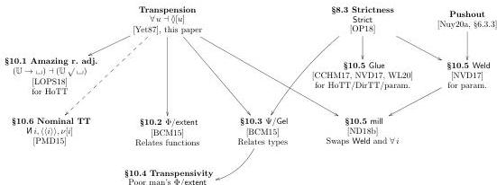

16:42

A. NUYTS AND D. DEVRIESE

Vol. 20:2

Figure 9: Recovering known operators: Dependency graph

**Remark 9.4.** This computation rule for TRANSP:ELIM is in a non-general context and needs to be forcibly closed under substitution. We could not find a better way to phrase this computation rule at the time of writing, but while preparing the camera-ready version of this paper, we believe the rule can be mended using the fact that $\bullet_{\forall u}^{u}$ has a further left adjoint $\bullet_{\exists u}^{u}$ so that an arbitrary context $\Theta$ can be universally approximated in the image of $\bullet_{\forall u}^{u}$ as $(\Theta, \bullet_{\exists u}^{u}, \bullet_{\forall u}^{u})$, not unlike how the modal formation and introduction rules of MTT itself were conceived (Fig. 4).

## 10. RECOVERING KNOWN OPERATORS

In this section, we explain how to recover the amazing right adjoint $\surd$ [LOPS18], BCM's $\Phi$ and $\Psi$ combinators [BCM15, Mou16], Glue [CCHM17, NVD17], Weld [NVD17] and mill [ND18b] and (without formal claims) locally fresh names [PMD15] from the transpension type, the strictness axiom [OP18] and certain pushouts. Figure 9 gives an overview of the dependencies.

10.1. **The amazing right adjoint $\surd$**. Licata et al. [LOPS18] use presheaves over a cartesian base category of cubes and introduce $\surd$ as the right adjoint to the non-dependent exponential $\mathbb{I} \to \sqcup$. We generalize to *semicartesian* base categories (indeed to copointed multipliers) and look for a right adjoint to $\mathbb{U} \to \sqcup$, which decomposes as substructural quantification after cartesian weakening $\forall(u : \mathbb{U}) \circ \Omega[u : \mathbb{U}]$. Then the right adjoint is obviously $\surd_{\mathbb{U}} := \Pi(u : \mathbb{U}) \circ \Omega[u : \mathbb{U}]$. The type constructor has type $\langle \surd_{\mathbb{U}} | \sqcup \rangle : (\surd_{\mathbb{U}} \upharpoonright \mathbb{U}_{\ell}) \to \mathbb{U}_{\ell}$ and the transposition rule is as in Proposition 3.4. This is an improvement in two ways: First, we have introduction, elimination and computation rules, so that we do not need to postulate functoriality of $\surd_{\mathbb{U}}$ and invertibility of transposition. Secondly, we have no need for a global sections modality $\flat$. Instead, we use the modality $\surd_{\mathbb{U}}$ to escape Licata et al.'s no-go theorems.

Our overly general mode theory does contain a global sections modality $\flat : \cdot \to \cdot$ acting in the empty shape context, and we can use this to recover Licata et al.'s axioms for the