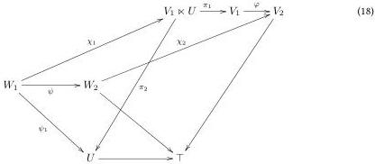
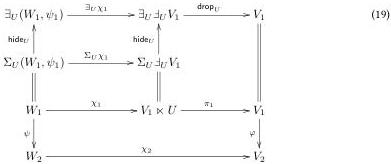
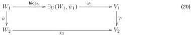

$$(V \ltimes U \xrightarrow{\psi \ltimes U} W \ltimes U)$$, where by convention $$\bot \ltimes U = \bot$$. It inherits all properties in definition 3.1.2 from $$\sqcup \ltimes U$$, except that it is never $$\top$$-slice objectwise pointable.

For reasons that will become apparent later, we write $$\mathbf{!}\sqrt{\sqcup} := (\sqcup \to \top)$$. Note that a $$(\mathbf{!}\sqrt{U})$$-cell is an unembargoed point with embargoed information about the degenerate $$U$$-cell on that point. E.g. in a context $$\Gamma.\mathbf{!}\Theta$$, an $$(\mathbf{!}\sqrt{\mathbb{I}})$$-cell is exactly a path in $$\Theta$$ above a point in $$\Gamma$$, which is a concept that we need to quantify over when defining internal Kan fibrancy [BT21].

If $$\sqcup \ltimes U$$ is copointed, then we can also lift a multiplier for $$U$$ to a multiplier for $$(\mathbf{!}\sqrt{U})$$ by applying the original one only to the domain, i.e. $$(V \xrightarrow{\psi} W) \ltimes (\mathbf{!}\sqrt{U}) = (V \ltimes U \xrightarrow{\psi \circ \pi_1} W)$$. This again inherits all properties in definition 3.1.2 from $$\sqcup \ltimes U$$, except that it is never $$\top$$-slice objectwise pointable, and that $$\top$$-slice fullness requires that $$\pi_1 : \sqcup \ltimes U \to \text{Id}$$ is objectwise epi (e.g. because $$U$$ is pointable) and $$\sqcup \ltimes U$$ is slicewise full, and that $$\top$$-slice right adjointness can only be inherited if $$\mathcal{W}$$ has pushouts. In that case, we have

$$\exists_{(\mathbf{!}\sqrt{U})}(W_1 \xrightarrow{\psi} W_2, (\psi_1, ())) = (\exists_U(W_1, \psi 1) \to W_2 \uplus_{W_1} \exists_U(W_1, \psi 1)). \tag{17}$$

Here, the morphism $$W_1 = \Sigma_U(W_1, \psi_1) \to \exists_U(W_1, \psi 1)$$ is an instance of the natural transformation $$\text{hide}_U : \Sigma_U \to \exists_U$$ obtained by lemma 2.1.1 from $$\pi_1 : \sqcup \ltimes U = \Sigma_U \upharpoonright_U \to \text{Id}$$ (theorem 3.4.4). Indeed, given a morphism of slice objects $$(\chi_1, \chi_2) : (W_1 \xrightarrow{\psi} W_2, (\psi_1, ())) \to \upharpoonright_{(\mathbf{!}\sqrt{U})}(V_1 \xrightarrow{\varphi} V_2)$$, i.e.

we get a commutative diagram (the upper right square commutes by construction of $$\text{hide}_U$$)

so the top horizontal line, which is the transpose of $$\chi_1$$, is a well-typed first component of the transpose of $$(\chi_1, \chi_2)$$, while the three horizontal lines together constitute an arrow from the pushout to $$V_2$$ which is a well-typed second component. Conversely, given $$(\omega_1, \omega_2) : \exists_{(\mathbf{!}\sqrt{U})}(W_1 \xrightarrow{\psi} W_2, (\psi_1, ())) \to (V_1 \xrightarrow{\varphi} V_2)$$, i.e. (unwrapping the pushout)

14