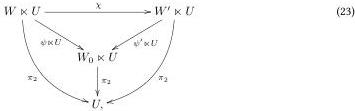

- An indirectly dimensionally split slice object \((V, \psi) \in \mathcal{V} / W_0 \ltimes U\) that is not in the image of \(\exists_U^{W_0}\) even up to isomorphism, will be called an indirect shard\(^{\S A}\) of the multiplier.

- Directly slicewise shard-free\(^{\S A}\) if for all \(W_0\), the functor \(\exists_U^{W_0}\) is essentially surjective on slice objects \((V, \varphi) \in \mathcal{V}/(W_0 \ltimes U)\) such that \(\varphi: V \to W_0 \ltimes U\) is directly dimensionally split:

- We say that \(\varphi : V \to W_0 \ltimes U\) is directly dimensionally split with direct dimensional section \(\chi : W \ltimes U \to V\) if \(\varphi \circ \chi\) is of the form \(\psi \ltimes U\). The section can alternatively be presented as a morphism of slice objects \(\chi : \exists_U^{W_0}(W, \psi) \to (V, \varphi)\).
- We denote the full subcategory of directly dimensionally split slice objects as \(\mathcal{V} // (W_0 \ltimes U)\).
- A directly dimensionally split slice object \((V, \psi) \in \mathcal{V} / W_0 \ltimes U\) that is not in the image of \(\exists_U^{W_0}\) even up to isomorphism, will be called a direct shard\(^{\S A}\) of the multiplier.

- Slicewise right adjoint\(^{\S A}\) if for all \(W_0\), the functor \(\exists_U^{W_0}\) has a left adjoint \(\exists_U^{W_0}: \mathcal{V}/(W_0 \ltimes U) \to \mathcal{W}/W_0\). We denote the unit as \(\text{copy}_U^{W_0}: \text{Id} \to \exists_U^{W_0} \exists_U^{W_0}\) and the co-unit as \(\text{drop}_U^{W_0}: \exists_U^{W_0} \exists_U^{W_0} \to \text{Id}\).

The above definition generalizes the functor \(\exists_U\) that we already had:

Proposition 3.5.2. The functor \(\exists_U^{\top}:\mathcal{W} / \top \to \mathcal{V} / (\top \ltimes U)\) is equal to \(\exists_U:\mathcal{W}\to \mathcal{V} / U\) over the obvious isomorphisms between their domains and codomains. Hence, each of the slicewise properties implies the \(\top\)-slice property. (Both notions of slicewise shard-freedom imply basic shard-freedom.)

Note that both notions of slicewise shard-freedom are well-defined:

Proposition 3.5.3. 1. (Obsolete.) The functor \(\exists_U^{W_0}\) factors over \((\mathcal{V} // U) / (W_0 \ltimes U, \pi_2)\).

2. The functor \(\exists_U^{W_0}\) factors over \(\mathcal{V} // (W_0 \ltimes U)\).
3. Directly dimensionally split morphisms are indirectly dimensionally split with the same section. As such, there is a functor \(\mathcal{V} // (W_0 \ltimes U) \to (\mathcal{V} // U) / (W_0 \ltimes U, \pi_2)\). Hence, direct shards are indirect shards and indirect slicewise shard-freedom implies direct slicewise shard-freedom.

Proof. 1. The functor \(\exists_U^{W_0}\) sends \((W,\psi)\) to \((W\times U,\psi\times U)\). Since \(\pi_2\circ (\psi \ltimes U) = \pi_2\), it is dimensionally split with the identity as a section.

2. The identity is a direct dimensional section.
3. Let \(\varphi : V \to W_0 \ltimes U\) be directly dimensionally split with section \(\chi\), i.e. \(\varphi \circ \chi = \psi \ltimes U\). Then \(\pi_2 \circ \varphi \circ \chi = \pi_2 \circ (\psi \ltimes U) = \pi_2\), so \(\pi_2 \circ \varphi\) is dimensionally split with section \(\chi\).

Proposition 3.5.4. If \(\sqcup \ltimes U:\mathcal{W}\to \mathcal{V}\) is \(\top\) -slice faithful, then it is slicewise faithful.

Proof. Pick morphisms \(\varphi, \chi : (W, \psi) \to (W', \psi')\) in \(\mathcal{W}/W_0\) such that \(\exists_U^{W_0} \varphi = \exists_U^{V} \chi\). Expanding the definition of \(\exists_U^{W_0}\), we see that this means that \(\varphi \ltimes U = \chi \ltimes U\), and hence \(\varphi = \chi\) by faithfulness of \(\sqcup \ltimes U\) (lemma 3.2.2).

Proposition 3.5.5. If \(\sqcup \ltimes U:\mathcal{W}\to \mathcal{V}\) is \(\top\) -slice fully faithful, then it is slicewise full.

Proof. Pick \((W, \psi)\) and \((W', \psi')\) in \(\mathcal{W}/W_0\), and a morphism \(\chi: \exists_U^{W_0}(W, \psi) \to \exists_U^{W_0}(W', \psi')\). This amounts to a diagram:

20