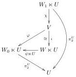
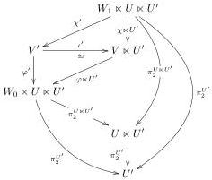
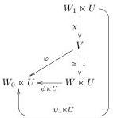
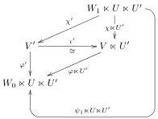

4. $\top$-slice faithful multipliers are slicewise faithful (proposition 3.5.4), and the composite $\exists_{U \ltimes U'} = \exists_{U'}^{U} \exists_U$ of faithful functors is faithful.

5-6. Follows from the first two properties, since the composite of full functors is full.

7. Analogous to the next point, with $W_0 = \top$.

8. Recall that the assumptions imply that $\sqcup \ltimes U'$ is slicewise fully faithful and slicewise indirectly and directly shard-free.

(a) Pick a slice object $(V', \varphi') \in \mathcal{V}'/(W_0 \ltimes U \ltimes U')$ such that $\pi_2^{U \ltimes U'} \circ \varphi' : V' \to U \ltimes U'$ is dimensionally split with section $\chi' : W_1 \ltimes U \ltimes U' \to V'$. Then $\pi_2^{U'} \circ \pi_2^{U \ltimes U'} \circ \varphi' = \pi_2^{U'} \circ \varphi' : V' \to U'$ is also dimensionally split with the same section.

Because $\sqcup \ltimes U'$ is indirectly slicewise shard-free, we find some $(V, \varphi) \in \mathcal{V}/(W_0 \ltimes U)$ such that $\iota' : (V', \varphi') \cong \exists_{U'}^{W_0 \ltimes U} (V, \varphi) \in \mathcal{V}'/(W_0 \ltimes U \ltimes U')$.

Note that $\pi_2^{U \ltimes U'} = \pi_2^U \ltimes U'$. Because $\exists_{U'}^{U}$ is full, the morphism $\iota' \circ \chi' : \exists_{U'}^{U} (W_1 \ltimes U, \pi_2^U) \to \exists_{U'}^{U} (V, \pi_2^U \circ \varphi)$ has a preimage $\chi : (W_1 \ltimes U, \pi_2^U) \to (V, \pi_2^U \circ \varphi)$ under $\exists_{U'}^{U}$. Thus, we see that $\pi_2 \circ \varphi : V \to U$ is dimensionally split. Because $\sqcup \ltimes U$ is indirectly slicewise shard-free, we find some slice object $(W, \psi) \in \mathcal{W}/W_0$ so that $\iota : (V, \varphi) \cong \exists_{U'}^{W_0} (W, \psi) \in \mathcal{V}/(W_0 \ltimes U)$. We conclude that

$$(V', \varphi') \cong \exists_{U'}^{W_0 \ltimes U} (V, \varphi) \cong \exists_{U'}^{W_0 \ltimes U} \exists_{U'}^{W_0} (W, \psi) = \exists_{U \ltimes U'}^{W_0} (W, \psi). \tag{27}$$

(b) Pick a slice object $(V', \varphi') \in \mathcal{V}'/(W_0 \ltimes U \ltimes U')$ that is directly dimensionally split for the composite multiplier with section $\chi' : W_1 \ltimes U \ltimes U' \to V'$, composing to $\varphi' \circ \chi' = \psi_1 \ltimes U \ltimes U'$. Then $\varphi'$ is also directly dimensionally split for $\sqcup \ltimes U'$.

Because $\sqcup \ltimes U'$ is directly slicewise shard-free, we find some $(V, \varphi) \in \mathcal{V}/(W_0 \ltimes U)$ such that $\iota' : (V', \varphi') \cong \exists_{U'}^{W_0 \ltimes U} (V, \varphi) \in \mathcal{V}'/(W_0 \ltimes U \ltimes U')$.

24