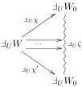
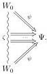
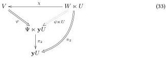

Moreover, the action of $\mathbb{J}_U^{\in \Psi}$ sends $(W_0, \chi, \psi)$ in eq. (31) to $(W_0, \mathbb{J}_U\chi, \psi)$ in eq. (30). Naively, one would say that this proves injectivity, but some care is required with the equality relation for co-ends. It might be that $(W_0, \chi, \psi)$ and $(W_0, \chi', \psi)$ are sent to the same object. This would mean that there exists a zigzag $\zeta$ from $W_0$ to itself and jagwise morphisms $\mathbb{J}_UW \to \mathbb{J}_U\zeta$ (a priori not necessarily in the image of $\mathbb{J}_U$ which is why we need $\top$-slice fullness) and jagwise cells $\zeta \Rightarrow \Psi$ such that the following diagrams commute:

(32)

Then by full faithfulness of $\mathbb{J}_U$, we see that the unique preimage of the left triangle exists and also commutes and hence $\psi \circ \chi = \psi \circ \chi'$, so that $(W_0, \chi, \psi) = (W, \mathrm{id}, \psi \circ \chi) = (W, \mathrm{id}, \psi \circ \chi') = (W_0, \chi', \psi)$. $\square$

**Proposition 4.1.6.** If $\sqcup \ltimes U$ is $\top$-slice fully faithful, then it is presheafwise full.

*Proof.* Pick $(W, \psi)$ and $(W', \psi')$ in $\mathcal{W}/\Psi$ and a morphism $\chi : \mathbb{J}_U^{\upharpoonright\Psi}(W, \psi) \to \mathbb{J}_U^{\upharpoonright\Psi}(W', \psi')$. Then we also have $\chi : \mathbb{J}_UW \to \mathbb{J}_UW'$ and by fullness, we find a preimage $\chi_0 : W \to W'$ under $\mathbb{J}_U$. We have $(\psi' \ltimes \mathbf{y}U) \circ \chi = \psi \ltimes \mathbf{y}U$, so by $\top$-slice elemental faithfulness, we see that $\psi' \circ \chi_0 = \psi$, so that $\chi_0$ is a morphism of slice objects $\chi_0 : (W, \psi) \to (W', \psi') \in \mathcal{W}/\Psi$ and $\mathbb{J}_U^{\upharpoonright\Psi}\chi_0 = \chi$. $\square$

**Proposition 4.1.7.** If $\sqcup \ltimes U$ is $\top$-slice full, then it is $\top$-slice elementally full.

*Proof.* In the proof of proposition 4.1.5, we saw that $\mathbb{J}_U^{\in \Psi}$ essentially sends $(W_0, \chi, \psi_0)$ to $(W_0, \mathbb{J}_U\chi, \psi_0)$. Then if $\mathbb{J}_U\chi$ is full, it is immediate that this operation is surjective. $\square$

**Proposition 4.1.8.** 1. If $\sqcup \ltimes U : \mathcal{W} \to \mathcal{V}$ is $\top$-slice full, then direct and indirect dimensional splitness are equivalent, with the same dimensional sections.

2. (Obsolete.) If $\sqcup \ltimes U$ is indirectly slicewise shard-free, then it is indirectly presheafwise shard-free.
3. If $\sqcup \ltimes U$ is $\top$-slice full and shard-free, then it is directly presheafwise shard-free.

*Proof.* 1. We already know that direct dimensional splitness implies indirect dimensional splitness with the same section (proposition 3.5.3). We prove the other implication.

Pick some $(V, \varphi) \in \mathcal{V}/(\Psi \ltimes \mathbf{y}U)$ that is indirectly dimensionally split with section $\chi$. By $\top$-slice elemental fullness, there is a cell $\psi : W \Rightarrow \Psi$ such that $\psi \ltimes \mathbf{y}U = \varphi \circ \chi : W \ltimes U \Rightarrow \Psi \ltimes \mathbf{y}U$. Then $\varphi$ is directly dimensionally split with section $\chi$.

2. Pick a slice object $(V, \varphi) \in \mathcal{V}/(\Psi \ltimes \mathbf{y}U)$ such that $\pi_2 \circ \varphi$ is dimensionally split. By definition of $\sqcup \ltimes \mathbf{y}U$, there is some $W_0$ such that $\varphi$ factors as $\varphi = (\psi^{W_0 \Rightarrow \Psi} \ltimes \mathbf{y}U) \circ \chi$. Clearly, $\pi_2 \circ \varphi = \pi_2 \circ \chi$ is dimensionally split. Hence, by indirect slicewise shard-freedom, $(V, \chi) \cong \mathbb{J}_U^{\upharpoonright W_0}(W, \chi') \in \mathcal{V}/(W_0 \ltimes U)$ for some $(W, \chi') \in \mathcal{W}/W_0$. Then we also have $(V, \varphi) = (V, (\psi \ltimes \mathbf{y}U) \circ \chi) \cong \mathbb{J}_U^{\upharpoonright \Psi}(W, \psi \circ \chi')$.

27