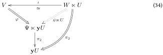
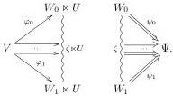

3. Pick some \((V, \varphi) \in \mathcal{V} / (\Psi \ltimes \mathbf{y}U)\) that is directly dimensionally split. Then \(\pi_2 \circ \varphi\) is dimensionally split. Because \(\exists_U\) is essentially surjective on \(\mathcal{V} // U\), there must be some \(W \in \mathcal{W}\) such that \(\iota : \exists_U W = (W \ltimes U, \pi_2) \cong (V, \pi_2 \circ \varphi)\) as slice objects over \(U\). By \(\top\)-slice elemental fullness, there is a cell \(\psi : W \Rightarrow \Psi\) such that \(\psi \ltimes \mathbf{y}U = \varphi \circ \iota : W \ltimes U \Rightarrow \Psi \ltimes \mathbf{y}U\). Thus, \(\iota^{-1} : (V, \varphi) \cong (W \ltimes U, \psi \ltimes \mathbf{y}U) = \exists_U^{/\Psi}(W, \psi)\) as slice objects over \(\Psi \ltimes \mathbf{y}U\).

Proposition 4.1.9. If \(\sqcup \ltimes U\) is \(\top\)-slice right adjoint, then it is presheafwise right adjoint, with

\[
\begin{array}{l} \exists_ {U} ^ {/ \Psi} (V, (\psi \ltimes \mathbf {y} U) \circ \varphi_ {0}) = \Sigma^ {/ \psi} \exists_ {U} ^ {/ W _ {0}} (V, \varphi_ {0}), \\ \operatorname{drop} _ {U} ^ {\prime \Psi} (W, \psi) = \operatorname{drop} _ {U} W, \\ \operatorname{copy} _ {U} ^ {\prime \Psi} (V, \varphi) = \operatorname{copy} _ {U} (V, \pi_ {2} \circ \varphi). \\ \end{array}
\]

Proof. Pick \((V,\varphi)\in \mathcal{V} / (\Psi \ltimes \mathbf{y}U)\). Then \(\varphi\) factors as \((\psi^{W_0\Rightarrow \Psi}\ltimes \mathbf{y}U)\circ \varphi_0^{V\to W_0\times U}\). Then \((V,\varphi_0)\in \mathcal{V} / (W_0\times U)\) and hence \(\exists_U^{W_0}(V,\varphi_0)\in \mathcal{W} / W_0\). We define

\[
\begin{array}{l} \exists_ {U} ^ {\prime \Psi} (V, \varphi) := \Sigma^ {\prime \psi} \exists_ {U} ^ {\prime W _ {0}} (V, \varphi_ {0}) \\ = \Sigma^ {\prime \psi} (\exists_ {U} (V, \pi_ {2} \circ \varphi_ {0}), \mathsf {d r o p} _ {U} \circ \exists_ {U} \varphi_ {0}) \\ = \left(\exists_ {U} \left(V, \pi_ {2} ^ {W _ {0} \ltimes U \rightarrow U} \circ \varphi_ {0}\right), \psi \circ \operatorname{drop} _ {U} \circ \exists_ {U} \varphi_ {0}\right) \\ = \left(\exists_ {U} \left(V, \pi_ {2} ^ {\Psi \ltimes \mathbf {y} U \rightarrow \mathbf {y} U} \circ \varphi\right), \psi \circ \operatorname{drop} _ {U} \circ \exists_ {U} \varphi_ {0}\right). \\ \end{array}
\]

We need to prove that this is well-defined, i.e. respects equality on the co-end that defines \( V \Rightarrow \Psi \ltimes \mathbf{y}U \). To this end, assume that \( \varphi = (\psi_0^{W_0 \Rightarrow \Psi} \ltimes \mathbf{y}U) \circ \varphi_0^{V \to W_0 \ltimes U} = (\psi_1^{W_1 \Rightarrow \Psi} \ltimes \mathbf{y}U) \circ \varphi_1^{V \to W_1 \ltimes U} \). This means there are a zigzag \( \zeta \) from \( W_0 \) to \( W_1 \), jagwise morphisms \( V \to \zeta \ltimes U \) and jagwise cells \( \zeta \Rightarrow \Psi \) such that the following triangles commute:

By naturality of \(\pi_2\), we find that \((V, \pi_2 \circ \varphi_0) = (V, \pi_2 \circ \varphi_1) \in \mathcal{V} / U\). By naturality of \(\mathrm{drop}_U\), we find that \(\psi_0 \circ \mathrm{drop}_U \circ \exists_U \varphi_0 = \psi_1 \circ \mathrm{drop}_U \circ \exists_U \varphi_1: (V, \pi_2 \circ \varphi_0) = (V, \pi_2 \circ \varphi_1) \Rightarrow \Psi\). We conclude that \(\exists_U^{/\Psi}(V, \varphi)\) is well-defined.

To prove adjointness, we first show how \(\exists_U^{\prime \Psi}\) on the right can be turned into \(\exists_U^{\prime \Psi}\) on the left. Pick a morphism \(\chi : (V, \varphi) \to \exists_U^{\prime \Psi}(W, \psi) = (W \ltimes U, \psi \ltimes \mathbf{y}U)\) in \(\mathcal{V}/(\Psi \ltimes \mathbf{y}U)\). Then one representation of \(\varphi\) is \(\varphi = (\psi \ltimes \mathbf{y}U) \circ \chi\) so by definition, \(\exists_U^{\prime \Psi}(V, \varphi) = (\exists_U(V, \pi_2 \circ \varphi), \psi \circ \mathrm{drop}_U \circ \exists_U \chi)\) which clearly factors over \(\psi\), i.e. has a morphism \(\mathrm{drop}_U \circ \exists_U \chi : \exists_U^{\prime \Psi}(V, \varphi) \to (W, \psi)\). If \(\chi = \mathrm{id}\), then we obtain the co-unit \(\mathrm{drop}_U^{\prime \Psi} = \mathrm{drop}_U \circ \exists_U \mathrm{id} = \mathrm{drop}_U\).

28