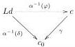
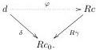

Lemma 2.1.2. Assume 4 triples of adjoint functors: \( E \dashv F \dashv G \) and \( E' \dashv F' \dashv G' \) and \( S_1 \dashv T_1 \dashv U_1 \) and \( S_2 \dashv T_2 \dashv U_2 \) such that the following diagram commutes up to natural isomorphism:

\[
\begin{array}{c} \mathcal {C} _ {1} \xrightarrow {F} \mathcal {C} _ {2} \\ T _ {1} \Bigg \downarrow \quad \Bigg \downarrow T _ {2} \\ \mathcal {C} _ {1} ^ {\prime} \xrightarrow [ F ^ {\prime} ]{} \mathcal {C} _ {2} ^ {\prime} \end{array} \tag {2}
\]

Then we have

\[
\begin{array}{l} E S _ {2} \cong S _ {1} E ^ {\prime} \quad E ^ {\prime} T _ {2} \rightarrow T _ {1} E \\ F S _ {1} \leftarrow S _ {2} F ^ {\prime} \quad F ^ {\prime} T _ {1} \cong T _ {2} F \quad F U _ {1} \rightarrow U _ {2} F ^ {\prime} \tag {3} \\ G ^ {\prime} T _ {2} \leftarrow T _ {1} G \quad G U _ {2} \cong U _ {1} G ^ {\prime}. \\ \end{array}
\]

In fact, any one of these statements holds if only the adjoints used by that statement are given.

Proof. The central isomorphism is given. The other isomorphisms are obtained by taking the left/right adjoints of both hands of the original isomorphism. By picking one direction of the central isomorphism, we can step to the left/right/top/bottom by applying lemma 2.1.1. \(\square\)

#### 2.1.2 Adjoints and categories with families

Proposition 2.1.3. If a functor \( R: \mathcal{C} \to \widehat{\mathcal{W}} \) from a CwF \( \mathcal{C} \) to a presheaf CwF \( \widehat{\mathcal{W}} \) has a left adjoint \( L \), then it is a weak CwF morphism.

Proof. We use the presheaf notations from [Nuy18] (section 2.3.1).

For \(\Gamma \vdash_{\mathcal{C}} T\) type, define \(R\Gamma \vdash_{\widehat{\mathcal{W}}} RT\) type by

\[
(W \triangleright_ {\widehat {\mathcal {W}}} (R T) [ \delta ]) := \cong (L \mathbf {y} W \vdash_ {\mathcal {C}} T [ \varepsilon \circ L \delta ]). \tag {4}
\]

Naturality of this operation is easy to show, and the action of \( R \) on terms is given by \( (^R t)[\delta] = t[\varepsilon \circ L\delta] \).

Definition 2.1.4. Given adjoint functors \( L \dashv R \) such that \( R \) is a weak CwF morphism, and \( A \in \mathrm{Ty}(L\Gamma) \), we write \( \langle R|A\rangle := (RA)[\eta] \in \mathrm{Ty}(\Gamma) \).

Note that \(\langle R|A[\varepsilon]\rangle = (RA)[R\varepsilon][\eta] = RA\).

#### 2.1.3 Adjoints and slice categories

Definition 2.1.5. For any \(U \in \mathcal{W}\), the slice category over \(U\), denoted \(\mathcal{W}/U\), has objects \((W, \psi)\) where \(W \in \mathcal{W}\) and \(\psi: W \to U\) and the morphisms \((W, \psi) \to (W', \psi')\) are the morphisms \(\chi: W \to W'\) such that \(\psi' \circ \chi = \psi\).

Definition 2.1.6. Given a functor \( F: \mathcal{V} \to \mathcal{W} \) and \( V_0 \in \mathrm{Obj}\mathcal{V} \), we define the action of \( F \) on slice objects over \( V_0 \) as the functor

\[
F ^ {/ V _ {0}}: \mathcal {V} / V _ {0} \to \mathcal {W} / F V _ {0}: (V, \varphi) \mapsto (F V, F \varphi).
\]

Proposition 2.1.7. Let \( L \dashv R : \mathcal{C} \to \mathcal{D} \) with \( \alpha : \mathrm{Hom}_{\mathcal{C}}(Lc, d) \cong \mathrm{Hom}_{\mathcal{D}}(c, Rd).^1 \). Then \( R^{/z} : \mathcal{C}/c_0 \to \mathcal{D}/Rc_0 : (c, \gamma) \mapsto (Rc, R\gamma) \) has a left adjoint \( L_{/z} : \mathcal{D}/Rc_0 \to \mathcal{C}/c_0 : (d, \delta) \mapsto (Ld, \alpha^{-1}(\delta)) \). The transposition operation is simply the restriction of \( \alpha \) to morphisms of slice objects.

Proof. There is a 1-1 correspondence between diagrams

\( ^{1} \) So  \( \alpha(\gamma)=R\gamma\circ\eta \)  and  \( \alpha^{-1}(\delta)=\varepsilon\circ L\delta \) .

3