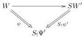
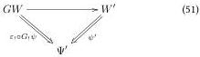

If a modality is both a right and a central lifting, then the following theorem relates the corresponding 'piped' modalities:

Theorem 5.0.2. If \( G: \mathcal{W} \to \mathcal{W}' \) has a right adjoint \( G \dashv S \), then we have

\[
\begin{array}{c c c c c c c c c c} & & \Sigma^ {\prime \varepsilon_ {!}} \circ G ^ {\prime S _ {!} \Psi^ {\prime}} & \dashv & S ^ {\prime \Psi^ {\prime}} & G ^ {\prime \Psi} & \dashv & \Omega^ {\prime \eta_ {!}} \circ S ^ {\prime G _ {!} \Psi} \\ \hline & & \Sigma^ {\varepsilon_ {!}} \circ G _ {!} ^ {S _ {!} \Psi^ {\prime}} & \dashv & S _ {!} ^ {\Psi^ {\prime}} & G _ {!} ^ {\Psi |} & \dashv & \Omega^ {\eta_ {!}} \circ S _ {!} ^ {G _ {!} \Psi |} & \cong & G ^ {\Psi | *} \\ S _ {!} ^ {\Psi^ {\prime}} | & \cong & G ^ {S _ {!} \Psi^ {\prime} | *} \circ \Omega^ {\varepsilon_ {!}} | & \dashv & S ^ {\Psi^ {\prime} | *} & G ^ {\Psi | *} & \dashv & S ^ {G _ {!} \Psi | *} \circ \Pi^ {\eta_ {!}} | & \cong & G _ {*} ^ {\Psi |} \\ S ^ {\Psi^ {\prime} | *} & \cong & \Pi^ {\varepsilon_ {!}} \circ G _ {*} ^ {S _ {!} \Psi^ {\prime}} | & \dashv & S _ {*} ^ {\Psi^ {\prime}} | & G _ {*} ^ {\Psi |} & \dashv & \S^ {\eta_ {!}} \circ S _ {*} ^ {G _ {!} \Psi |} \end{array} \tag {50}
\]

assuming - where mentioned - that \(\Omega^{\prime \eta_{!}}\) exists.

Proof. For the left half of the table, we only prove the first line. The other adjunctions follow from the fact that \(\sqcup_{!},\sqcup^{*}\) and \(\sqcup_{*}\) are pseudofunctors, and the isomorphisms follow from uniqueness of the adjoint. We have a correspondence of diagrams

i.e. morphisms \((W,\psi)\to S^{\prime /\Psi^{\prime}}(W^{\prime},\psi^{\prime}):\mathcal{W} / S_{!}\Psi^{\prime}\) correspond to morphisms \(\Sigma^{\prime \varepsilon_1}G^{\prime S_1\Psi^{\prime}}(W,\psi)\to\) \((W^{\prime},\psi^{\prime}):\mathcal{W}^{\prime} / \Psi^{\prime}\).

On the right side of the table, we similarly only need to prove the first line, and we prove it from the first line on the left side. The left adjoint to \(\Omega^{\prime \eta_{!}}\circ S^{\prime G_{!}\Psi}\) is \(\left(\Sigma^{\prime \varepsilon_{!}}\circ G^{\prime S_{!}G_{!}\Psi}\right)\circ \Sigma^{\prime \eta_{!}}\). We prove that this is equal to \(G^{\prime \Psi}\):

\[
\begin{array}{l} \Sigma^ {\prime \varepsilon_ {!}} G ^ {\prime S _ {!} G _ {!} \Psi} \Sigma^ {\prime \eta_ {!}} (W, \psi : W \to \Psi) \\ = \Sigma^ {\prime \varepsilon_ {!}} G ^ {\prime S _ {!} G _ {!} \Psi} (W, \eta_ {!} \circ \psi : W \rightarrow S _ {!} G _ {!} \Psi) \\ = \Sigma^ {\prime \varepsilon_ {!}} (G W, G _ {!} \eta_ {!} \circ G _ {!} \psi : G W \rightarrow G _ {!} S _ {!} G _ {!} \Psi) \\ = (G W, \varepsilon_ {!} \circ G _ {!} \eta_ {!} \circ G _ {!} \psi : G W \rightarrow G _ {!} \Psi) = (G W, G _ {!} \psi : G W \rightarrow G _ {!} \Psi). \\ \end{array}
\]

## 6 Commutation rules

### 6.1 Substitution and substitution

See theorem 2.3.18.

### 6.2 Modality and substitution

Theorem 6.2.1. Assume a functor \( G: \mathcal{W} \to \mathcal{W}' \) and a morphism \( \sigma: \Psi_1 \to \Psi_2: \widehat{\mathcal{W}} \). Then we have a commutative diagram

\[
\begin{array}{c} \mathcal {W} / \Psi_ {1} \xrightarrow {G ^ {\prime} \Psi_ {1}} \mathcal {W} ^ {\prime} / G _ {!} \Psi_ {1} \\ \Sigma^ {\prime \sigma} \Bigg \downarrow \quad \Bigg \downarrow \Sigma^ {\prime G _ {!} \sigma} \\ \mathcal {W} / \Psi_ {2} \xrightarrow [ G ^ {\prime} \Psi_ {2} ]{} \mathcal {W} ^ {\prime} / G _ {!} \Psi_ {2} \end{array} \tag {52}
\]

and hence

|   | \( G_{!} \) | \( G^{*} \) | \( G_{*} \)  |
| --- | --- | --- | --- |
|  \( \Sigma \) | \( \Sigma^{G_{!}\sigma|}G_{!}^{\Psi_{1}|} \cong G_{!}^{\Psi_{2}|}\Sigma^{\sigma|} \) | \( \Sigma^{\sigma|}G^{\Psi_{1}|*} \to G^{\Psi_{2}|*}\Sigma^{G_{!}\sigma|} \) |   |
|  \( \Omega \) | \( \Omega^{G_{!}\sigma|}G_{!}^{\Psi_{2}|} \leftarrow G_{!}^{\Psi_{1}|}\Omega^{\sigma|} \) | \( \Omega^{\sigma|}G^{\Psi_{2}|*} = G^{\Psi_{1}|*}\Omega^{G_{!}\sigma|} \) | \( \Omega^{G_{!}\sigma|}G_{*}^{\Psi_{2}|} \to G_{*}^{\Psi_{1}|}\Omega^{\sigma|} \)  |
|  \( \Pi \) |  | \( \Pi^{\sigma|}G^{\Psi_{1}|*} \leftarrow G^{\Psi_{2}|*}\Pi^{G_{!}\sigma|} \) | \( \Pi^{G_{!}\sigma|}G_{*}^{\Psi_{1}|} \cong G_{*}^{\Psi_{2}|}\Pi^{\sigma|} \)  |
|  \( \S \) |  |  | \( \S^{G_{!}\sigma|}G_{*}^{\Psi_{2}|} \leftarrow G_{*}^{\Psi_{1}|}\S^{\sigma|} \)  |

40