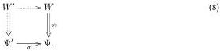

Definition 2.3.14. Given \(\sigma : \Psi' \to \Psi\) in \(\widehat{\mathcal{W}}\), we write

- \(\Sigma^{\prime \sigma}:\mathcal{W} / \Psi^{\prime}\to \mathcal{W} / \Psi :(W^{\prime},\psi^{\prime})\mapsto (W^{\prime},\sigma \circ \psi^{\prime}),\)
- \(\Omega^{\prime \sigma}:\mathcal{W} / \Psi \to \mathcal{W} / \Psi^{\prime}\) for the functor that maps \((W,\psi)\) to its pullback along \(\sigma\) (if \(\mathcal{W}\) has pullbacks along \(\sigma\)), by which we mean a universal solution \(W^{\prime}\) to the diagram

If \(\sigma = \pi_1: \Psi \times \Phi \to \Psi\), we also write \(\Sigma_{\Phi}^{\prime/\Psi}: \mathcal{W}/(\Psi \times \Phi) \to \mathcal{W}/\Psi\) and \(\Omega_{\Phi}^{\prime/\Psi}: \mathcal{W}/\Psi \to \mathcal{W}/(\Psi \times \Phi)\).

Proposition 2.3.15. If \(\Omega^{\prime \sigma}\) exists, then \(\Sigma^{\prime \sigma} \dashv \Omega^{\prime \sigma}\). We denote the unit as \(\mathrm{copy}^{\prime \sigma}: \mathrm{Id} \to \Omega^{\prime \sigma} \Sigma^{\prime \sigma}\) and the co-unit as \(\mathrm{drop}^{\prime \sigma}: \Sigma^{\prime \sigma} \Omega^{\prime \sigma} \to \mathrm{Id}\).

Proposition 2.3.16 (Not used). 1. If \(\sigma\) is surjective, then \(\Omega^{\prime \sigma}\) is faithful.

2. If  \( \sigma \)  is injective, then  \( \Sigma^{\prime\sigma} \)  is full. \( ^{7} \)

Proof. 1. If \(\sigma\) is surjective, then by the axiom of choice, there is at least a non-natural \(f: \Psi \to \Psi'\) such that \(\sigma \circ f = \mathrm{id}\). The rest of the proof is as for proposition 2.3.13.

2. Same as for proposition 2.3.13.

Definition 2.3.17. The functors \(\Sigma^{\prime \sigma} \dashv \Omega^{\prime \sigma}\) give rise to four adjoint functors

\[
\Sigma^ {\sigma |} \dashv \Omega^ {\sigma |} \dashv \Pi^ {\sigma |} \dashv \S^ {\sigma |} \tag {9}
\]

between  \( \widehat{W/\Psi} \)  and  \( \widehat{W/\Psi'} \) , of which the first three exist if only  \( \Sigma^{\prime\sigma} \)  exists. \( ^{8} \)

The units and co-units will be denoted:

\[
\begin{array}{l} \operatorname{copy} ^ {\sigma |}: \quad \operatorname{Id} \rightarrow \Omega^ {\sigma |} \Sigma^ {\sigma |} \\ \operatorname{const} ^ {\sigma |}: \quad \operatorname{Id} \rightarrow \Pi^ {\sigma |} \Omega^ {\sigma |} \\ \operatorname{reidx} ^ {\sigma |}: \quad \operatorname{Id} \rightarrow \S^ {\sigma |} \Pi^ {\sigma |} \\ \operatorname{drop} ^ {\sigma |}: \quad \Sigma^ {\sigma |} \Omega^ {\sigma |} \to \operatorname{Id} \\ \operatorname{app} ^ {\sigma |}: \quad \Omega^ {\sigma |} \Pi^ {\sigma |} \to \operatorname{Id} \\ \operatorname{unmerid} ^ {\sigma |}: \quad \Pi^ {\sigma |} \S^ {\sigma |} \to \operatorname{Id} \\ \end{array}
\]

We remark that, if we read presheaves over \(\mathcal{W}/\Psi\) as types in context \(\Psi\), then \(\Omega^{\sigma|}:\widehat{\mathcal{W}/\Psi}\to\widehat{\mathcal{W}/\Psi'}\) is the standard interpretation of substitution in a presheaf category. If \(\sigma=\pi:\Psi.A\to\Psi\) is a weakening morphism, then \(\Omega_{A}^{\Psi|}:=\Omega^{\pi|}\) is the weakening substitution, \(\Pi_{A}^{\Psi|}:=\Pi^{\pi|}:\widehat{\mathcal{W}/\Psi.A}\to\widehat{\mathcal{W}/\Psi}\) is isomorphic to the standard interpretation of the \(\Pi\)-type and \(\Sigma_{A}^{\Psi|}:=\Sigma^{\pi|}:\widehat{\mathcal{W}/\Psi.A}\to\widehat{\mathcal{W}/\Psi}\) is isomorphic to the standard interpretation of the \(\Sigma\)-type.

Theorem 2.3.18. Given types \(\Psi \vdash A, B\) type, the projections constitute a pullback diagram:

\[
\begin{array}{c} \Psi . (A \times B) \xrightarrow {\beta^ {\prime}} \Psi . A \\ \alpha^ {\prime} \Bigg \downarrow \quad \Bigg \downarrow \alpha \\ \Psi . B \xrightarrow {\beta} \Psi , \end{array} \tag {11}
\]

\( ^{7} \) An earlier version asserted fullness of  \( \Omega^{\prime\sigma} \)  instead, but proved the current theorem.

 \( ^{8} \) The latter functor is already a cartesian transpension functor; however we have not guaranteed its existence. Later on we will discuss a transpension functor for certain – not necessarily cartesian – shapes, modelled by multipliers, and there we will guarantee existence.

8