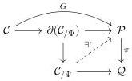

1:28

M. SHULMAN

Vol. 19:2

For instance, a birepresentable LNL polycategory is a *-autonomous closed LNL adjunction, a birepresentable symmetric polycategory is a *-autonomous category, a birepresentable cartesian multicategory is a cartesian closed category, and so on.⁵

Similarly, we can define a general notion of limit that encompasses all four cases. In fact, we can define a general notion that encompasses both universal morphisms and (weighted) limits and colimits!

Definition 4.14. An abstract cone is a small entries-only LNL polycategory $\mathcal{C}$ equipped with a specified signed object $K$ called the vertex, such that $\mathcal{C}(\Phi)$ is empty if $\Phi$ contains any copies of $K^{\bullet}$ or contains more than one copy of $K$, except that $\mathcal{C}(K^{\bullet}, K) = \{1_K\}$. Nonidentity morphisms containing $K$ (necessarily exactly once) are called abstract projections, while morphisms not containing $K$ are called abstract transitions. Note that no two abstract projections can be composable. The reduct of an abstract cone is its sub-LNL-polycategory obtained by removing the underlying object of $K$, its identity morphism, and all the abstract projections; we denote this by $\partial\mathcal{C}$.

An expansion of an abstract cone $\mathcal{C}$ is determined by a finite number of new objects (each linear or nonlinear) and a sign for each of them, yielding a signed list $\Psi$, such that $(K^{\bullet}, \Psi)$ is admissible (where $K$ is the vertex of $\mathcal{C}$). The expansion itself is an entries-only LNL polycategory denoted $\mathcal{C}_{/\Psi}$ (which is not itself an abstract cone) obtained by adding the new objects to $\mathcal{C}$ along with one new morphism $\widetilde{f} \in \mathcal{C}_{/\Psi}(\Phi, \Psi)$ for each abstract projection $f \in \mathcal{C}(\Phi, K)$, called the expanders, and an additional new morphism $\chi \in \mathcal{C}_{/\Psi}(K^{\bullet}, \Psi)$ called the factorization. Composition is defined by $\chi \circ_K f = \widetilde{f}$, and by $\widetilde{f} \circ g = \widetilde{f \circ g}$ when $g$ is an abstract transition. The corresponding pre-expansion is the sub-LNL-polycategory $\partial(\mathcal{C}_{/\Psi}) \subseteq \mathcal{C}_{/\Psi}$ obtained by omitting the morphism $\chi$. Note that we have inclusions

$$\partial\mathcal{C} \subseteq \mathcal{C} \subseteq \partial(\mathcal{C}_{/\Psi}) \subseteq \mathcal{C}_{/\Psi}.$$

Definition 4.15. By a concrete cone we mean a functor whose domain is an abstract cone. Let $\pi : \mathcal{P} \to \mathcal{Q}$ a functor of (entries-only) LNL polycategories, and $G : \mathcal{C} \to \mathcal{P}$ a concrete cone. We say that $G$ is $\pi$-extremal if for any expansion $\mathcal{C}_{/\Psi}$ of $\mathcal{C}$, any commutative square as shown below such that the composite $\mathcal{C} \to \partial(\mathcal{C}_{/\Psi}) \to \mathcal{P}$ is $G$ has a unique diagonal filler.

If $\mathcal{Q} = \text{LNLPOLY}$ is terminal, instead of $\pi$-extremal we say that $G$ is universal.

We will be primarily interested in two important classes of abstract cones, which show respectively that the notion of extremal cone includes both cartesian/universal morphisms and limits and colimits. Here is the first.

⁵In the literature, sometimes “representable” means only that “covariant” universal arrows exist, e.g. a “representable symmetric multicategory” is a not-necessarily-closed symmetric monoidal category. But other times it means that all universal arrows exist, e.g. a “representable polycategory” is a *-autonomous category. Our “birepresentable”, in analogy to “bifibration”, avoids ambiguity.