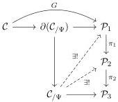

1:32

M. SHULMAN

Vol. 19:2

FIGURE 1. Diagram for Proposition 4.30

composite $\widetilde{f} \circ Gg \in \mathcal{P}(G\Psi, G\Phi, K_f)$ satisfies

$$\pi(\widetilde{f} \circ Gg) = \pi(\widetilde{f}) \circ \pi(Gg) = H(f) \circ H(g) = H(f \circ g).$$

Thus, by the universal property of $\widetilde{f \circ_L g} \in \mathcal{P}(G\Psi, G\Phi, K_{f \circ_L g})$ it induces a unique morphism $\widetilde{g} \in \mathcal{P}(K_{f \circ_L g}^\bullet, K_f)$ such that $\pi(\widetilde{g}) = 1_K$.

Now these objects $K_f$ and morphisms $\widetilde{g}$ form a small diagram of objects of $\mathcal{P}$ (linear or nonlinear according as $K$ is such) lying in the fiber over $K$. In particular, therefore, the image of this diagram under $\pi$ admits a specified cone (if $K$ is negative) or cocone (if $K$ is positive) with vertex $H(K)$, consisting entirely of identity maps. Thus, since $\pi$ is fiberwise bicomplete, this cone of identity maps has a $\pi$-extremal lift. Composing the projections of this lift with the morphisms $\widetilde{f}$ yields a $\pi$-extremal concrete cone $\mathcal{C} \to \mathcal{P}$ extending $G$ and lifting $H$.

Of course, there are analogous results in which set-theoretic size of the limits and colimits and of the abstract cones are limited in chosen ways. We also have a version of Proposition 2.9 and its converse.

**Proposition 4.28.** Given $\pi : \mathcal{P} \to \mathcal{Q}$ and an abstract cone $\mathcal{C}$ with vertex $K$, if $F, G : \mathcal{C} \to \mathcal{P}$ coincide on the reduct $\partial\mathcal{C}$ and are both $\pi$-extremal, then there is a unique isomorphism $\phi : F(K) \cong G(K)$ such that $\pi(\phi)$ is an identity and such that $\phi \circ_K F(f) = G(f)$ for all abstract projections $f$ in $\mathcal{C}$.

Given $\pi : \mathcal{P} \to \mathcal{Q}$, an abstract cone $\mathcal{C}$ with vertex $K$, a concrete cone $G : \mathcal{C} \to \mathcal{P}$, and an isomorphism $\phi : G(K) \cong K'$, there is a concrete cone $G_\phi : \mathcal{C} \to \mathcal{P}$ that agrees with $G$ on the reduct $\partial\mathcal{C}$, sends the vertex to $K'$, and the abstract projections $f$ to $G_\phi(f) = \phi \circ G(f)$.

**Proposition 4.29.** If in the above construction $G$ is $\pi$-extremal, so is $G_\phi$.

And a composition property for functors:

**Proposition 4.30.** Suppose $\pi_1 : \mathcal{P}_1 \to \mathcal{P}_2$ and $\pi_2 : \mathcal{P}_2 \to \mathcal{P}_3$, and a concrete cone $G : \mathcal{C} \to \mathcal{P}_1$. If $G$ is $\pi_1$-extremal and $\pi_1 G$ is $\pi_2$-extremal, then $G$ is $\pi_2 \pi_1$-extremal.

Proof. In the diagram in Figure 1, to find a unique lift in the rectangle, we first find a unique lower diagonal lift and then a unique upper one.