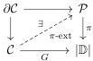

Vol. 19:2

LNL POLYCATEGORIES AND DOCTRINES OF LINEAR LOGIC

1:33

## 5. DOCTRINES AND SKETCHES

In Section 3 we encountered a long list of categorical structures that form locally full sub-2-categories of LNLPoly. In this section and the next we will define a general class of such sub-2-categories, which we call (sorted, LNL) doctrines. Inspecting the examples in Section 3, we see that each is characterized by three kinds of data:

- (i) Restrictions on the kinds of objects (e.g. no nonlinear objects) and the arities of morphisms (e.g. all linear morphisms are co-unary). We have already remarked that these restrictions can be detected by slicing LNLPoly over subterminals such as SYMMULTI, CBPV, etc. More generally, we can equip the objects or morphisms with structure by slicing over a non-subterminal object, such as PLMULTI, DBLSPLIT, and SMADJ in Remarks 2.4 and 2.7 and Example 4.8.
- (ii) Existence of universal cones, for all cones in some family (e.g. existence of tensors, internal-homs, modalities, or limits or colimits). Sometimes the universal property of these cones has to be restricted to respect the allowed arities of morphisms, which corresponds to asking for cartesian lifts over the base objects in (i).
- (iii) Requirements that certain adjunctions are of some “Kleisli type”, hence determined by a monad, a comonad, or both.

In this section we define LNL doctrines, which encapsulate (i) and (ii). In the next section we extend these to “sorted doctrines” that incorporate (iii) as well.

Definition 5.1. An LNL doctrine $\mathbb{D}$ is an LNL polycategory $|\mathbb{D}|$ equipped with a family of concrete cones $G : \mathcal{C} \to |\mathbb{D}|$, called the $\mathbb{D}$-cones. We say $\mathbb{D}$ is small if $|\mathbb{D}|$ is small and the family of cones is also small.

Given such a doctrine, a $\mathbb{D}$-category is an LNL polycategory $\mathcal{P}$ equipped with a functor $\pi : \mathcal{P} \to |\mathbb{D}|$ that has extremal lifts of all $\mathbb{D}$-cones:

A $\mathbb{D}$-functor between $\mathbb{D}$-categories is a morphism in LNLPoly/$|\mathbb{D}|$ that preserves $\pi$-extremal lifts of $\mathbb{D}$-cones, and a $\mathbb{D}$-transformation between $\mathbb{D}$-functors is a 2-cell in LNLPoly/$|\mathbb{D}|$. This defines a locally full sub-2-category $\mathbb{D}$-Cat $\subseteq$ LNLPoly.

Example 5.2. Let $|\mathbb{D}| =$ LNLPOLY be terminal, and let the $\mathbb{D}$-cones contain one representative from each isomorphism class of cones$^6$ constructed in Definition 4.16. Then by Theorem 4.12, a $\mathbb{D}$-category is a birepresentable LNL polycategory.

Similarly, if $|\mathbb{D}| =$ LNLPOLY and the $\mathbb{D}$-cones contain one representative of each isomorphism class of cones, by Theorem 4.27 a $\mathbb{D}$-category is a bicomplete birepresentable LNL polycategory. (Note that this doctrine is not small.) We can include more restricted classes of limits as well by combining the cones from Definition 4.16 with some of those from Definition 4.18; e.g. there is a (small) doctrine for birepresentable LNL polycategories with finite products and coproducts (additives).

Example 5.3. Taking $|\mathbb{D}|$ to be one of the subterminals SYMPOLY, SYMMULTI, CARTMULTI, CAT, and LNLMULTI from Remark 2.3, we can equip it with a family of cones that specify

$^6$An isomorphism of abstract cones is an isomorphism of LNL polycategories that preserves the vertices.