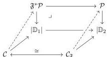
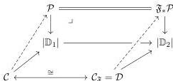

1:36

M. SHULMAN

Vol. 19:2

given by composition with $|\mathfrak{F}|$ and pullback along it, so it suffices to lift this to sketches. For the right adjoint $\mathfrak{F}^*$, we define a lift $\mathcal{C} \to \mathfrak{F}^*\mathcal{P}$ of some $\mathbb{D}_1$-cone $\mathcal{C} \to |\mathbb{D}_1|$ to be proto-extremal if the composite $\mathcal{C}_{\mathfrak{F}} \cong \mathcal{C} \to \mathfrak{F}^*\mathcal{P} \to \mathcal{P}$ is proto-extremal:

For the left adjoint $\mathfrak{F}_*$, we define a lift $\mathcal{D} \to \mathfrak{F}_*\mathcal{P}$ of some $\mathbb{D}_2$-cone $\mathcal{D} \to |\mathbb{D}_2|$ to be proto-extremal if the latter $\mathbb{D}_2$-cone is the $F$-image of some $\mathbb{D}_1$-cone $\mathcal{C} \to |\mathbb{D}_1|$ and there is a proto-extremal lift $\mathcal{C} \to \mathcal{P}$ making the evident diagram commute:

It is straightforward to check that these constructions lift the 2-adjunction.

We really want an analogous adjunction $\mathbb{D}_1$-Cat $\rightleftarrows \mathbb{D}_2$-Cat, but this can only be expected to be a pseudo 2-adjunction, satisfying its universal property up to equivalence.$^7$ We will construct this in Section 9, using the above strict 2-adjunction.

## 6. SORTED DOCTRINES

In Section 3 we chose to represent monads and comonads as their Kleisli adjunction rather than their Eilenberg–Moore adjunction (or any other), due to Lemma 3.8. Thus, to impose the third kind of “Kleisli type” condition mentioned in Section 5, it suffices to assert essential-surjectivity properties for some of the modalities.

**Definition 6.1.** An **arrow-type abstract cone** is determined by two signed objects $K, L$ (each linear or nonlinear). Its vertex is $K$, and its only nonidentity morphism is an abstract projection in $\mathcal{C}(L, K)$.

If a cone belonging to a doctrine $\mathbb{D}$ is arrow-type determined by $K, L$, then by choosing extremal lifts, any $\mathbb{D}$-category can be equipped with a functor from the fiber over $L$ to the fiber over $K$. This functor is contravariant if $K$ and $L$ have the same sign and covariant if they have different signs. Of the cones from Definition 4.16 representing the basic universal properties from Section 2, $\mathsf{F}, \mathsf{U}, \mathsf{J}, \mathsf{\Pi}, (\cdot)^*$ are arrow-type.

**Definition 6.2.** A **sorted LNL doctrine** is an LNL doctrine $\mathbb{D}$ together with:

$^7$A pseudo 2-adjunction is traditionally called a “biadjunction”, but this seems inadvisable here since we are using the prefix “bi-” with a different connotation in “bifibration” and “bicomplete”.