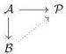

Vol. 19:2

LNL POLYCATEGORIES AND DOCTRINES OF LINEAR LOGIC

1:41

## 7. THE DOCTRINAL COMPLETION OF A SKETCH

We will now show that any $\mathbb{D}$-sketch can be completed to a $\mathbb{D}$-category in a universal way. Recall (see e.g. [AR94]) that an object $\mathcal{P}$ of a category is said to be **injective** with respect to a set of morphisms $\mathcal{I}$ if for any morphism $\mathcal{A} \to \mathcal{B}$ in $\mathcal{I}$, any morphism $\mathcal{A} \to \mathcal{P}$ can be extended to $\mathcal{B}$ (not necessarily uniquely):

The class of all $\mathcal{I}$-injective objects is called a **small-injectivity class** (“small-” since $\mathcal{I}$ is a set rather than a proper class). If we require the extensions to be *unique*, we obtain the related notions of **orthogonal** object and **small-orthogonality class**. In a category with pushouts, $\mathcal{P}$ is orthogonal to $\mathcal{A} \to \mathcal{B}$ if and only if it is injective with respect to $\mathcal{A} \to \mathcal{B}$ and its codiagonal $\mathcal{B} +_{\mathcal{A}}\mathcal{B} \to \mathcal{B}$; thus every small-orthogonality class is also a small-injectivity class.

**Theorem 7.1.** *If $\mathbb{D}$ is small, then the $\mathbb{D}$-complete sketches are a small-injectivity class in $\mathbb{D}$-Sketch.*

*Proof.* Given any $\mathbb{D}$-cone $G : \mathcal{C} \to |\mathbb{D}|$, we regard it as a $\mathbb{D}$-sketch in which the only proto-extremal cone is $G$ itself. We also regard its reduct as a $\mathbb{D}$-sketch via the composite $\partial\mathcal{C} \hookrightarrow \mathcal{C} \to |\mathbb{D}|$, with no proto-extremal cones at all. Then a $\mathbb{D}$-sketch $\mathcal{P}$ is precomplete if and only if it is injective to the inclusions of $\mathbb{D}$-sketches $\partial\mathcal{C} \hookrightarrow \mathcal{C}$.

Similarly, given any $\mathbb{D}$-cone $G : \mathcal{C} \to |\mathbb{D}|$, any expansion of it (Definition 4.14), and any extension of $G$ to $G_{\Psi} : \mathcal{C}_{/\Psi} \to |\mathbb{D}|$, we regard $\mathcal{C}_{/\Psi}$ and its corresponding pre-expansion $\partial(\mathcal{C}_{/\Psi})$ as $\mathbb{D}$-sketches via $G_{\Psi}$ and its restriction to $\partial(\mathcal{C}_{/\Psi})$, in which the only proto-extremal cone is $G$. Then a $\mathbb{D}$-sketch $\mathcal{P}$ is realized if and only if it is *orthogonal* to the set of inclusions of $\mathbb{D}$-sketches $\partial(\mathcal{C}_{/\Psi}) \hookrightarrow \mathcal{C}_{/\Psi}$, indexed over all $G$, $\Psi$, and $G_{\Psi}$.

Finally, given an abstract cone $\mathcal{C}$ with vertex $K$, let $\mathcal{C}_{\cong}$ denote the LNL polycategory that is $\mathcal{C}$ with an additional signed object $K'$ isomorphic to $K$. There is a fold map $\mathcal{C}_{\cong} \to \mathcal{C}$ that collapses $K$ and $K'$ both to $K$, which has two sections $s, s' : \mathcal{C} \to \mathcal{C}_{\cong}$ sending $K$ to $K$ and $K'$ respectively. If $G : \mathcal{C} \to \mathbb{D}$ is a $\mathbb{D}$-cone, we can regard $\mathcal{C}_{\cong}$ as a $\mathbb{D}$-sketch via the composite $\mathcal{C}_{\cong} \to \mathcal{C} \to |\mathbb{D}|$, in which both $s$ and $s'$ are proto-extremal. We can also regard it as a $\mathbb{D}$-sketch in which only $s$ is proto-extremal; we denote this sketch by $\mathcal{C}'_{\cong}$. Then a $\mathbb{D}$-sketch is saturated if and only if it is injective with respect to the set of inclusions of $\mathbb{D}$-sketches $\mathcal{C}'_{\cong} \hookrightarrow \mathcal{C}_{\cong}$.

Let $\mathcal{I}_{\mathbb{D}}$ denote the set of all the morphisms

$$\partial\mathcal{C} \hookrightarrow \mathcal{C} \qquad \partial(\mathcal{C}_{/\Psi}) \hookrightarrow \mathcal{C}_{/\Psi}$$

$$\mathcal{C}'_{\cong} \hookrightarrow \mathcal{C}_{\cong} \qquad \mathcal{C}_{/\Psi} +_{\partial(\mathcal{C}_{/\Psi})} \mathcal{C}_{/\Psi} \to \mathcal{C}_{/\Psi}$$

as $\mathcal{C}$ ranges over the $\mathbb{D}$-cones. Then a sketch is $\mathbb{D}$-complete if and only if it is injective with respect to $\mathcal{I}_{\mathbb{D}}$. $\square$

**Remark 7.2.** The proof shows that realized $\mathbb{D}$-sketches are actually a small-orthogonality class. Saturated $\mathbb{D}$-sketches are also a small-orthogonality class, since the inclusions $\mathcal{C}'_{\cong} \hookrightarrow \mathcal{C}_{\cong}$ are epimorphic (being the identity on underlying LNL polycategories).