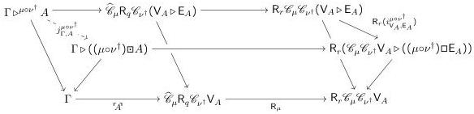
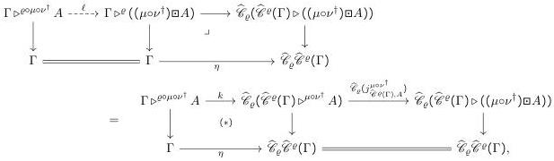
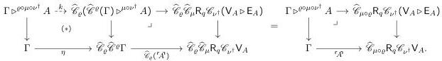
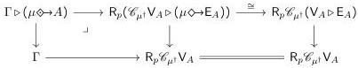

18–14

Semantics of multimodal adjoint type theory

(a) Introduction rule

(b) Elimination rule, part 1

(c) Elimination rule, part 2

Fig. 7. Positive modalities in an adjoint modal pre-model

show \(\Gamma \triangleright (\mu \diamondsuit \rightarrow A) \cong \Gamma \triangleright^{\mu_*} A\). Now \(\Gamma \triangleright (\mu \diamondsuit \rightarrow A)\) is defined by the pullback square at left below:

Composing with the isomorphism on the right, we obtain the defining pullback of \(\Gamma \triangleright^{\mu_*} A\) as in (5.6).

## 6 Diagrams of 1-topoi

Combining Theorems 5.12, 5.17 and 5.19, we have the following. (Recall Assumption 2.4.)